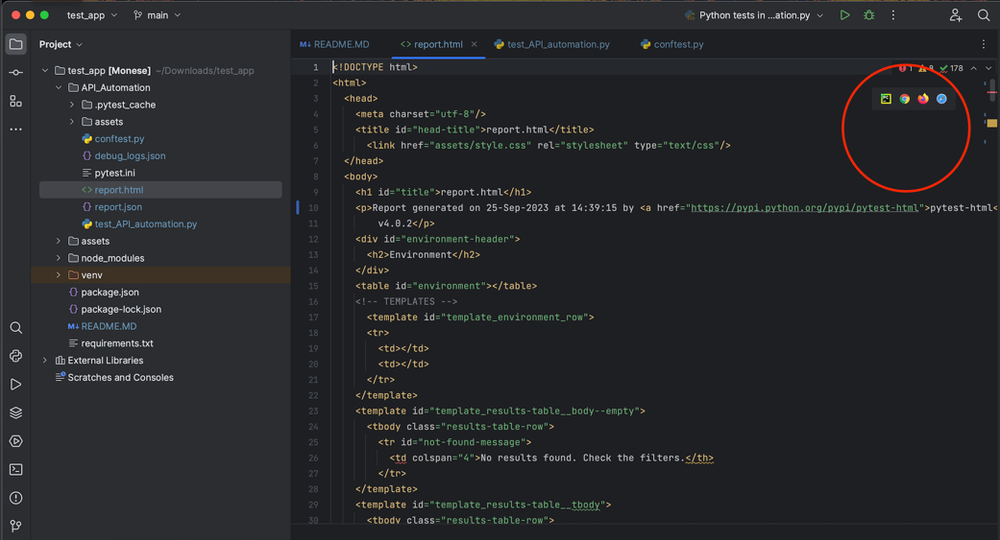
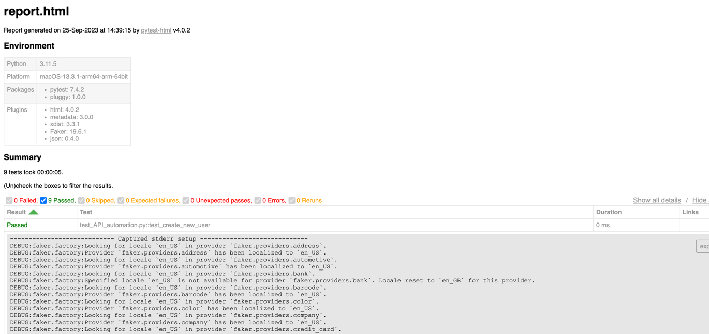

This project is created for API automation using website
https://gorest.co.in/ using pytest, faker and requests

1. Clone this project
2. install requirements from requirements.txt
   pip install -r requirements.txt
3. Under API_Automation directory locate conftest.py and open it
4. Inside conftest.py at line number 11 you'll notice ACCESS_TOKEN
   replace that access token with your token / check my email reply
5. Run test_API_automation.py 
6. The form will be created in the same path with name <>report.html
7. After running test_API_automation.py open this <>report.html and click (screenshot below to view detailed logs for each tests) 
 

# Monese_API_Automation
# Monese_API_Automation
# Monese_API_Automation
# Monese_API_Automation
# Monese_API_Automation
# Monese_API_Automation
